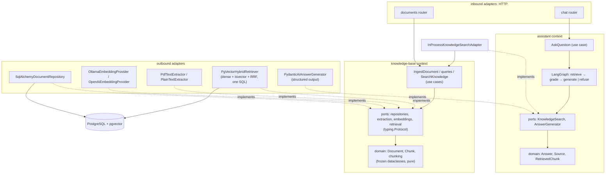
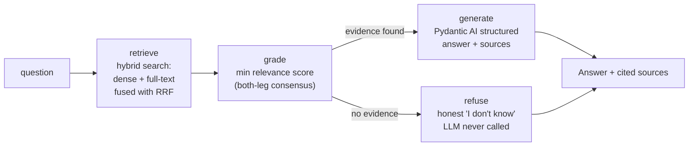

# fastapi-langgraph-rag-hexagonal

[](https://github.com/victormartingil/fastapi-langgraph-rag-hexagonal/actions/workflows/ci.yml)
[](#testing)
[](https://www.python.org/)
[](https://github.com/astral-sh/ruff)
[](LICENSE)

A **production-shaped, didactic reference project**: a RAG (Retrieval-Augmented
Generation) API built with **hexagonal architecture** (ports & adapters) in
idiomatic Python — the kind of codebase you clone to start a team project, or
read to learn how the pieces fit together. "Shaped", not "ready": it ships the
discipline (layering enforced by tests, migrations, dedup, auth hook, honest
refusals) while the heavy production features stay on the
[roadmap](#roadmap-explicitly-phase-2--not-implemented-here).

**Runs with zero API keys**: Ollama serves both the embedding model and the
chat model locally. OpenAI is a `.env` switch away.

---

## What it does

| Endpoint                    | Description                                                                 |
| --------------------------- | --------------------------------------------------------------------------- |
| `POST /api/v1/documents`    | Ingest `.md`/`.txt`/`.pdf` → extract → chunk → embed → PostgreSQL+pgvector. Idempotent: same content returns the existing document (200), not a twin (201) — dedup keys on **content**, so a re-upload with a new title keeps the original title. Size-capped via `KA_MAX_UPLOAD_SIZE_MB` (413); corrupt/encrypted files rejected with 422; a transient embedding-provider outage degrades honestly to 503 |
| `GET /api/v1/documents`     | List the knowledge base — paginated (`limit`/`offset`), chunk counts without loading embeddings |
| `GET /api/v1/documents/{id}`| Fetch one document                                                          |
| `POST /api/v1/chat`         | Ask a question → hybrid retrieval → graded → cited answer (or honest refusal). A retrieval or generation backend outage degrades honestly to 503, never an opaque 500 or a degraded 200. All errors share one envelope: `{detail, error, correlation_id}` |
| `GET /livez`                | **Liveness** probe: process is up — no dependencies, always 200 (never behind auth) |
| `GET /health` / `GET /healthz` | **Readiness** probe: database check; 503 = "don't route traffic yet" (never behind auth, so probes keep working) |

The read side is a **LangGraph pipeline**: hybrid search (dense vectors +
PostgreSQL full-text, fused with Reciprocal Rank Fusion) → relevance grading →
answer generation with **structured, validated output** (Pydantic AI). If no
relevant context survives grading, the system **refuses to answer instead of
hallucinating**.

## Quick start (5 minutes)

Prerequisites: Docker (with Compose) — nothing else.

```bash
git clone git@github.com:victormartingil/fastapi-langgraph-rag-hexagonal.git
cd fastapi-langgraph-rag-hexagonal
docker compose up --build
```

This starts PostgreSQL+pgvector, Ollama, a one-shot init container that pulls
`nomic-embed-text` + `llama3.1` (first run downloads a few GB), and the API
(migrations run automatically). Then:

```bash
# 1. Ingest the sample document
curl -F "file=@samples/return-policy.md" -F "title=Return Policy" \
     http://localhost:8000/api/v1/documents

# 2. Ask a question the document answers
curl -X POST http://localhost:8000/api/v1/chat \
     -H 'Content-Type: application/json' \
     -d '{"question": "Can I return a product after two months?"}'
```

You get an answer grounded in the policy ("no refund after 30 days; store
credit may be offered up to day 90") **with the exact source chunk cited**.
Ask something unrelated (`"How do I bake sourdough bread?"`) and you get the
honest refusal instead. Interactive docs at `http://localhost:8000/docs`; a
[Bruno](https://www.usebruno.com/) collection lives in `api-collections/`.

## Architecture

Two bounded contexts — `knowledge_base` (document lifecycle and search) and
`assistant` (grounded Q&A) — each layered
**domain ← application ← adapters**, with dependencies pointing inward
only. The rule is executable: import-linter contracts run as tests.



### The RAG flow



The details, with file pointers: [docs/01](docs/01-hexagonal-architecture-in-python.md) ·
[docs/02](docs/02-rag-explained.md) · [docs/03](docs/03-langgraph-orchestration.md) ·
[threat model](docs/06-threat-model.md) · [ADRs](docs/adr/).

## Project layout

```
src/knowledge_assistant/
├── main.py                  # create_app() — entry point
├── config.py                # Settings (pydantic-settings, KA_* env vars)
├── bootstrap.py             # composition root: the ONLY place adapters are chosen
├── knowledge_base/          # bounded context: documents, indexing, retrieval
│   ├── domain/              #   models, value objects, chunking (pure)
│   ├── application/         #   ports (Protocols) + public use cases
│   └── adapters/            #   inbound HTTP; outbound persistence/extraction/search
├── assistant/               # bounded context: grounded Q&A
│   ├── domain/              #   Answer, Source, RetrievedChunk
│   ├── application/         #   ports, AskQuestion, graph/ (LangGraph)
│   └── adapters/            #   inbound HTTP; outbound knowledge bridge / LLM
├── shared_kernel/           # only truly shared values and domain errors
└── platform/                # database lifecycle/migrations, HTTP, observability
tests/
├── unit/                    # domain + use cases + graph nodes, hand-written fakes
├── architecture/            # import-linter contracts + naming rules
├── integration/             # testcontainers: real Postgres+pgvector
└── e2e/                     # full HTTP flow; AI faked via dependency overrides
```

## Development

Requires [uv](https://docs.astral.sh/uv/) (and Docker only for the
integration/e2e suites).

```bash
uv sync                                # create .venv, install locked deps
cp .env.example .env                   # optional; defaults match docker-compose

uv run ruff check .                    # lint
uv run ruff format --check .           # format
uv run mypy --strict src tests         # types (source AND tests)
uv run pytest tests/unit tests/architecture        # fast, NO Docker needed
uv run pytest tests/integration tests/e2e          # real Postgres via testcontainers
```

Run the API locally against the compose database/ollama:

```bash
docker compose up db ollama ollama-init
uv run alembic upgrade head
uv run uvicorn knowledge_assistant.main:create_app --factory --reload
```

If you run Ollama **natively** instead of via compose, pull the models once:

```bash
ollama pull nomic-embed-text   # embeddings
ollama pull llama3.1           # answer generation
```

Switching to OpenAI: provider flags drive per-provider defaults on **both**
sides (model/endpoint/dimension are filled in automatically; override any of
them with its `KA_*` variable):

```bash
KA_LLM_PROVIDER=openai        # defaults: gpt-4o-mini @ api.openai.com
KA_LLM_API_KEY=sk-...         # required; model/endpoint overridable via
                              # KA_LLM_MODEL / KA_LLM_BASE_URL
```

The **LLM** switch works out of the box. The **embedding** switch selects a
working adapter (OpenAI → `text-embedding-3-small` @ api.openai.com, 1536
dims, `KA_EMBEDDING_API_KEY` required) — but the shipped schema is
`vector(768)`, so booting with OpenAI embeddings stops at the startup guard
until you regenerate the Alembic migration for the new dimension (and bump
`SCHEMA_EMBEDDING_DIMENSION` with it). That is deliberate, not a missing
feature — see [ADR-0001](docs/adr/0001-pgvector-as-vector-store.md).

### Non-English corpora

The vector leg is language-agnostic; full-text search is configured for one
language per database via `KA_FTS_LANGUAGE` (default `english`) — any
PostgreSQL text-search configuration works, e.g. `spanish`, `german`, or
`simple` for mixed-language corpora. The choice is **schema-bound** (like the
embedding dimension): set it before the first migration, or rebuild the
schema on a fresh database — `KA_FTS_LANGUAGE=spanish uv run alembic upgrade
head`. Alembic reads the same `.env` as the app, and the app **verifies at
startup** that the database was built for the configured language (recorded
in `schema_meta` by migration 0004) — a mismatch fails fast, naming both
languages and the fix ([ADR-0004](docs/adr/0004-schema-bound-config-parity-guard.md)).
Caveat: tsvector does not segment CJK text, so Chinese/Japanese/Korean
corpora rely on the dense leg. Details:
[docs/02](docs/02-rag-explained.md#multilingual-retrieval).

### Optional API-key auth

Off by default (local development). Set `KA_API_KEY` and every `/api/v1/*`
endpoint requires the `X-API-Key` header (constant-time comparison, 401 on
mismatch). Two deliberate exceptions: the probes (`/livez`, `/health`,
`/healthz`) stay open, and
the interactive docs (`/docs`, `/redoc`, `/openapi.json`) are **closed** when
auth is on — they enumerate every endpoint and schema, which is exactly what
the key is meant to protect. This is a deployment-level guard, not
multi-tenant security — JWT/OIDC and rate limiting are Phase 2
(roadmap below).

### Operational hardening

- **Probe split**: `/livez` is *liveness* (dependency-free — the Docker
  healthcheck uses it; a Kubernetes `livenessProbe` belongs here), `/health`
  and its alias `/healthz` are *readiness* (database check — a 503 means
  "don't route traffic yet", never "restart the process"). Keeping them
  apart is what stops a transient DB hiccup from becoming a restart loop.
- **Restart policy**: `db`, `ollama` and `api` run with
  `restart: unless-stopped`, so a crashed service self-heals. The `api`
  image runs uvicorn via `exec` (PID 1), so `SIGTERM` reaches the server
  directly and shutdown is graceful.
- **Short transactions**: ingestion never holds a database connection
  across the slow extraction/embedding steps — each unit of work is a
  millisecond-scale transaction, so a busy embedding provider cannot
  exhaust the connection pool ([ADR-0005](docs/adr/0005-short-transaction-ingest.md)).
- **Honest outages**: embedding provider down, LLM down, or database down
  all surface as a 503 with the unified envelope
  `{detail, error, correlation_id}` — and an unexpected bug as the same
  envelope with 500, correlation ID included.
- **Grounding contract**: an affirmative answer requires at least one valid
  source index. Invalid model output is retried, then fails with a typed 502;
  it is never returned as a successful uncited answer. Questions and document
  content are serialized and labeled as untrusted data. This reduces prompt
  injection risk but does not eliminate it; see the
  [threat model](docs/06-threat-model.md).
- **Image pinning**: the Compose images are pinned by tag
  (`pgvector:0.8.1-pg16`, `ollama:0.13.1`). For real deployments, pin by
  digest — `name:tag@sha256:...` — so a re-published tag cannot silently
  change what you run (`docker buildx imagetools inspect <name:tag>` prints
  the digest). Tags are kept here deliberately: a demo stack should bump
  patch fixes on a deliberate `docker compose pull`, not drift daily.

### Pinned stack (resolved by `uv.lock`)

Python 3.13 · FastAPI 0.139 · LangGraph 1.2 · Pydantic AI 2.15 ·
SQLAlchemy 2.0 (async, asyncpg) · Alembic 1.18 · pgvector 0.5 · Pydantic 2.13 ·
structlog 25 · tenacity 9 · pytest 9 · testcontainers 4.14 · ruff 0.15 ·
mypy 1.20 · import-linter 2.13

## Testing

Four suites, one pyramid — full rationale in
[docs/04-testing-strategy.md](docs/04-testing-strategy.md):

| Suite             | Count | Needs Docker | Proves                                              |
| ----------------- | ----- | ------------ | --------------------------------------------------- |
| unit              | 110   | No           | domain rules, chunking (incl. hard-split overlap + sliver merge), use cases (dedup, race recovery → 409, dimension assertion, batching, pagination, zero-DB-scope embedding per ADR-0005), every graph node, refusal path, mappers, AI adapters (respx-mocked HTTP, transient-only retries, tenacity as single retry authority), retriever + repository outage translation (OperationalError/InterfaceError/raw asyncpg OSError → 503 signal, ProgrammingError → untouched), embedding-adapter outage contract (exhausted retries → 503 signal), Unicode FTS tokenizer (incl. mega-token cap), FTS parity comparison + missing-table pgcode classification, config validators (fts_language), transient taxonomy (429/RemoteProtocolError/WriteError/CloseError/ProxyError), LLM error doctrine (transient → 503 signal, permanent → loud), error-envelope mapping (unmapped domain error → 500), client lifecycle + partial-close resilience, extraction adapters, container guards + wiring |
| architecture      | 3     | No           | layering contracts, context independence, naming rules |
| integration       | 18    | Yes          | ORM ↔ real migrated schema, content-hash unique index + race recovery, summary projections without chunk hydration (list + single-get), hybrid SQL ranking vs real pgvector, HNSW index query plan, FTS-language parity guard (schema_meta recorded by migration 0004, tamper → fail fast), Spanish FTS (own container migrated with `KA_FTS_LANGUAGE=spanish`: stemming, stop words, dense-leg fallback) |
| e2e               | 29    | Yes          | full HTTP journey, error mapping (404/409/413/415/422/503), correlation IDs, cited answers, idempotent re-upload, pagination, API-key auth on/off, docs closed under auth, real container wiring (default top_k), provider-down → honest 503 on chat AND ingest AND generation, database-down → honest 503 envelope (KnowledgeBaseUnavailableError), unhandled exception → unified 500 envelope + correlation header, probe split (/livez up under DB outage, /health(z) 503), unified error envelope (401/404/422-validation), WWW-Authenticate on 401 |

The 80% coverage gate applies to domain+application under the unit suite —
currently **100%**. The AI adapters (embeddings, LLM) are unit-tested with
respx-mocked HTTP; the database adapters are covered by integration/e2e tests
against real infrastructure, where coverage is meaningful.

CI (`.github/workflows/ci.yml`): lint + types + unit/architecture on every
push; integration + e2e on pull requests. Pre-commit hooks mirror CI:
`uv run pre-commit install`.

**Commit style**: [Conventional Commits](https://www.conventionalcommits.org/)
(`feat:`, `fix:`, `docs:`, `test:`, `refactor:`, `chore:`), optionally scoped —
e.g. `feat(chat): add grading node`.

## Learning paths

**Junior** — "make it run, then follow one request":
1. Quick start above → play with `/docs`.
2. `docs/02-rag-explained.md` (the concepts).
3. Read `knowledge_base/application/ingest.py` (a use case end-to-end), then
   `tests/unit/test_document_services.py` (how it's tested without Docker).
4. Exercise: add a new file type extractor (`.html`) — port, adapter, wiring
   in `bootstrap.py`, unit test.

**Mid** — "own a feature":
1. `docs/01-hexagonal-architecture-in-python.md` and the ADRs.
2. `assistant/application/policies.py` and the LangGraph orchestration adapter.
3. `docs/04-testing-strategy.md`; break an import-linter rule on purpose and
   watch CI catch it.
4. Exercise: implement the LLM-based grader from
   [docs/03](docs/03-langgraph-orchestration.md#extending-the-graph-guided-exercise).

**Senior** — "judge the trade-offs":
1. ADRs [0001](docs/adr/0001-pgvector-as-vector-store.md) /
   [0002](docs/adr/0002-langgraph-as-orchestration-adapter.md) /
   [0003](docs/adr/0003-hybrid-retrieval.md) — argue with them.
2. The RRF SQL in `knowledge_base/adapters/outbound/retrieval/pgvector_hybrid.py` and its
   integration tests.
3. `docs/05-java-to-python-cheatsheet.md` if you mentor Java developers.
4. Exercise: pick a roadmap item below and design it on paper first.

## Roadmap (explicitly Phase 2 — NOT implemented here)

1. **RAG evaluation in CI** with a golden dataset (DeepEval or Ragas).
2. **LLM observability**: OpenTelemetry (GenAI semantic conventions) +
   Langfuse in docker-compose.
3. **Ad-hoc document mode** with a LangGraph router node: small attached
   document → context stuffing (no vectorization); large → ephemeral in-memory
   chunk+embed. Decision criterion: context-window fit.
4. **LangGraph Postgres checkpointer** for durable execution and multi-turn
   conversation memory.
5. **Platform features**: JWT/OIDC auth (an optional shared API key already
   exists), rate limiting, Kafka events, SSE streaming, MCP server exposing
   the retriever as a tool.

## License

[MIT](LICENSE).
