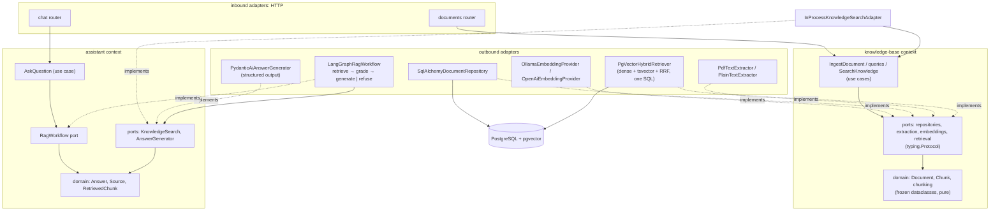
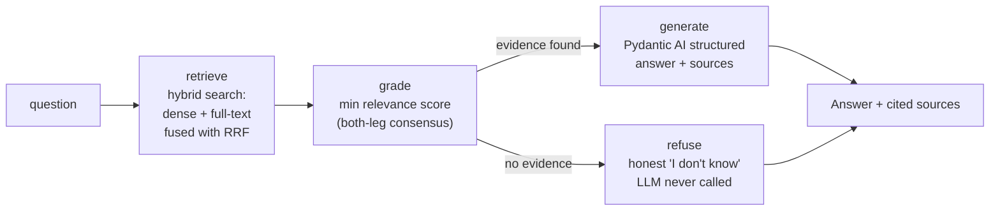

# fastapi-langgraph-rag-hexagonal

[](https://github.com/victormartingil/fastapi-langgraph-rag-hexagonal/actions/workflows/ci.yml)
[](#testing)
[](https://www.python.org/)
[](https://github.com/astral-sh/ruff)
[](LICENSE)

A **production-shaped, didactic reference project**: a RAG (Retrieval-Augmented
Generation) API built with **hexagonal architecture** (ports & adapters) in
idiomatic Python — the kind of codebase you clone to start a team project, or
read to learn how the pieces fit together. "Shaped", not "ready": it ships the
discipline (layering enforced by tests, migrations, dedup, auth hook, honest
refusals) while the heavy production features stay on the
[roadmap](#roadmap-explicitly-phase-2--not-implemented-here).

**Runs with zero API keys**: Ollama serves both the embedding model and the
chat model locally. OpenAI is a `.env` switch away.

**Already coming from Java?** Start with
[`python-for-java-devs`](https://github.com/victormartingil/python-for-java-devs);
this repository is its advanced continuation, not a duplicate cheatsheet.

---

## What it does

| Endpoint                    | Description                                                                 |
| --------------------------- | --------------------------------------------------------------------------- |
| `POST /api/v1/documents`    | Ingest `.md`/`.txt`/`.pdf` → extract → chunk → embed → PostgreSQL+pgvector. Idempotent: same content returns the existing document (200), not a twin (201) — dedup keys on **content**, so a re-upload with a new title keeps the original title. Size-capped via `KA_MAX_UPLOAD_SIZE_MB` (413); corrupt/encrypted files rejected with 422; a transient embedding-provider outage degrades honestly to 503 |
| `GET /api/v1/documents`     | List the knowledge base — paginated (`limit`/`offset`), chunk counts without loading embeddings |
| `GET /api/v1/documents/{id}`| Fetch one document                                                          |
| `POST /api/v1/chat`         | Ask a question → hybrid retrieval → graded → cited answer (or honest refusal). A retrieval or generation backend outage degrades honestly to 503, never an opaque 500 or a degraded 200. All errors share one envelope: `{detail, error, correlation_id}` |
| `GET /livez`                | **Liveness** probe: process is up — no dependencies, always 200 (never behind auth) |
| `GET /health` / `GET /healthz` | **Readiness** probe: database check; 503 = "don't route traffic yet" (never behind auth, so probes keep working) |

The read side is a **LangGraph pipeline**: hybrid search (dense vectors +
PostgreSQL full-text, fused with Reciprocal Rank Fusion) → relevance grading →
answer generation with **structured, validated output** (Pydantic AI). If no
relevant context survives grading, the system **refuses to answer instead of
hallucinating**.

## Quick start (5 minutes)

Prerequisites: Docker (with Compose) — nothing else.

```bash
git clone git@github.com:victormartingil/fastapi-langgraph-rag-hexagonal.git
cd fastapi-langgraph-rag-hexagonal
docker compose up --build
```

This starts PostgreSQL+pgvector, Ollama, a one-shot init container that pulls
`nomic-embed-text` + `qwen3.5:9b` (first run downloads a few GB), and the API
(migrations run automatically). Then:

```bash
# 1. Ingest the sample document
curl -F "file=@samples/return-policy.md" -F "title=Return Policy" \
     http://localhost:8000/api/v1/documents

# 2. Ask a question the document answers
curl -X POST http://localhost:8000/api/v1/chat \
     -H 'Content-Type: application/json' \
     -d '{"question": "Can I return a product after two months?"}'
```

You get an answer grounded in the policy **with the exact source chunk
cited**:

```json
{
  "answer": "After two months, a refund is no longer available. Up to day 90, store credit may be offered at the company's discretion only when the item is defective or was shipped incorrectly.",
  "sources": [
    {
      "document_id": "…",
      "document_title": "Return Policy",
      "chunk_id": "…",
      "excerpt": "Between day 31 and day 90, we may offer store credit at our discretion, and only for items that are defective or were shipped incorrectly.",
      "score": 0.0325
    }
  ]
}
```

Ask something unrelated (`"How do I bake sourdough bread?"`) and you get the
honest refusal instead. Interactive docs at `http://localhost:8000/docs`; a
[Bruno](https://www.usebruno.com/) collection lives in `api-collections/`.

## Architecture

Two bounded contexts — `knowledge_base` (document lifecycle and search) and
`assistant` (grounded Q&A) — each layered
**domain ← application ← adapters**, with dependencies pointing inward
only. The rule is executable: import-linter contracts run as tests.



### The RAG flow



Start with the [architecture overview](docs/00-architecture-overview.md), then
[bounded-context ownership](docs/08-bounded-context-ownership.md) and
[Pythonic ports and adapters](docs/09-pythonic-ports-and-adapters.md).
Deep dives: [RAG](docs/02-rag-explained.md) ·
[LangGraph](docs/03-langgraph-orchestration.md) ·
[testing/evals](docs/04-testing-strategy.md) ·
[threat model](docs/06-threat-model.md) ·
[observability](docs/07-observability.md) ·
[evolution](docs/10-evolution.md) · [ADRs](docs/adr/).

## Project layout

```
src/knowledge_assistant/
├── main.py                  # create_app() — entry point
├── config.py                # Settings (pydantic-settings, KA_* env vars)
├── bootstrap.py             # composition root: the ONLY place adapters are chosen
├── knowledge_base/          # bounded context: documents, indexing, retrieval
│   ├── domain/              #   models, value objects, chunking (pure)
│   ├── application/         #   ports (Protocols) + public use cases
│   └── adapters/            #   inbound HTTP; outbound persistence/extraction/search
├── assistant/               # bounded context: grounded Q&A
│   ├── domain/              #   Answer, Source, RetrievedChunk
│   ├── application/         #   ports, AskQuestion, pure policies
│   └── adapters/            #   HTTP; knowledge/LLM; LangGraph orchestration
├── shared_kernel/           # only the DomainError root shared by both contexts
└── platform/                # database lifecycle/migrations, HTTP, observability
tests/
├── unit/                    # domain + use cases + graph nodes, hand-written fakes
├── architecture/            # import-linter contracts + naming rules
├── integration/             # testcontainers: real Postgres+pgvector
├── e2e/                     # full HTTP flow; AI faked via dependency overrides
└── evals/                   # deterministic dataset/metric/regression contracts
```

## Development

Requires [uv](https://docs.astral.sh/uv/) (and Docker only for the
integration/e2e suites).

```bash
uv sync --locked                       # create .venv, install locked deps
cp .env.example .env                   # optional; defaults match docker-compose

uv run --locked ruff check .           # lint
uv run --locked ruff format --check .  # format
uv run --locked mypy --strict src tests
uv run --locked pytest tests/unit tests/architecture
uv run --locked pytest tests/integration tests/e2e
```

Run the API locally against the compose database/ollama:

```bash
docker compose up db ollama ollama-init
uv run --locked alembic upgrade head
uv run --locked uvicorn knowledge_assistant.main:create_app --factory --reload
```

If you run Ollama **natively** instead of via compose, pull the models once:

```bash
ollama pull nomic-embed-text   # embeddings
ollama pull qwen3.5:9b         # default answer generation
ollama pull qwen3.5:4b         # optional lower-memory experiment
```

The default local LLM is `qwen3.5:9b`. `qwen3.5:4b` supports schema-constrained
output, but in the live smoke it produced valid citations with insufficient
factual coverage on a simple policy question, so it is documented only as a
lower-memory experiment via `KA_LLM_MODEL=qwen3.5:4b`.

Switching to OpenAI: provider flags drive per-provider defaults on **both**
sides (model/endpoint/dimension are filled in automatically; override any of
them with its `KA_*` variable):

```bash
KA_LLM_PROVIDER=openai        # defaults: gpt-4o-mini @ api.openai.com
KA_LLM_API_KEY=sk-...         # required; model/endpoint overridable via
                              # KA_LLM_MODEL / KA_LLM_BASE_URL
```

The **LLM** switch works out of the box. The **embedding** switch selects a
working adapter (OpenAI → `text-embedding-3-small` @ api.openai.com, 1536
dims, `KA_EMBEDDING_API_KEY` required) — but the shipped schema is
`vector(768)`, so booting with OpenAI embeddings stops at the startup guard
until you regenerate the Alembic migration for the new dimension (and bump
`SCHEMA_EMBEDDING_DIMENSION` with it). That is deliberate, not a missing
feature — see [ADR-0001](docs/adr/0001-pgvector-as-vector-store.md).

### Non-English corpora

The vector leg is language-agnostic; full-text search is configured for one
language per database via `KA_FTS_LANGUAGE` (default `english`) — any
PostgreSQL text-search configuration works, e.g. `spanish`, `german`, or
`simple` for mixed-language corpora. The choice is **schema-bound** (like the
embedding dimension): set it before the first migration, or rebuild the
schema on a fresh database —
`KA_FTS_LANGUAGE=spanish uv run --locked alembic upgrade head`. Alembic reads
the same `.env` as the app, and the app **verifies at
startup** that the database was built for the configured language (recorded
in `schema_meta` by migration 0004) — a mismatch fails fast, naming both
languages and the fix ([ADR-0004](docs/adr/0004-schema-bound-config-parity-guard.md)).
Caveat: tsvector does not segment CJK text, so Chinese/Japanese/Korean
corpora rely on the dense leg. Details:
[docs/02](docs/02-rag-explained.md#multilingual-retrieval).

### Optional API-key auth

Off by default (local development). Set `KA_API_KEY` and every `/api/v1/*`
endpoint requires the `X-API-Key` header (constant-time comparison, 401 on
mismatch). Two deliberate exceptions: the probes (`/livez`, `/health`,
`/healthz`) stay open, and
the interactive docs (`/docs`, `/redoc`, `/openapi.json`) are **closed** when
auth is on — they enumerate every endpoint and schema, which is exactly what
the key is meant to protect. This is a deployment-level guard, not
multi-tenant security — JWT/OIDC and rate limiting are Phase 2
(roadmap below).

### Operational hardening

- **Probe split**: `/livez` is *liveness* (dependency-free — the Docker
  healthcheck uses it; a Kubernetes `livenessProbe` belongs here), `/health`
  and its alias `/healthz` are *readiness* (database check — a 503 means
  "don't route traffic yet", never "restart the process"). Keeping them
  apart is what stops a transient DB hiccup from becoming a restart loop.
- **Restart policy**: `db`, `ollama` and `api` run with
  `restart: unless-stopped`, so a crashed service self-heals. The `api`
  image runs uvicorn via `exec` (PID 1), so `SIGTERM` reaches the server
  directly and shutdown is graceful.
- **Short transactions**: ingestion never holds a database connection
  across the slow extraction/embedding steps — each unit of work is a
  millisecond-scale transaction, so a busy embedding provider cannot
  exhaust the connection pool ([ADR-0005](docs/adr/0005-short-transaction-ingest.md)).
- **Honest outages**: embedding provider down, LLM down, or database down
  all surface as a 503 with the unified envelope
  `{detail, error, correlation_id}` — and an unexpected bug as the same
  envelope with 500, correlation ID included.
- **Grounding contract**: an affirmative answer requires at least one valid
  source index. Invalid model output is retried, then fails with a typed 502;
  it is never returned as a successful uncited answer. Questions and document
  content are serialized and labeled as untrusted data. This reduces prompt
  injection risk but does not eliminate it; see the
  [threat model](docs/06-threat-model.md).
- **Content-safe telemetry**: optional OpenTelemetry spans and metrics cover
  extraction, embeddings, retrieval, grading, generation, retries,
  abstentions, and evidence counts. Correlation IDs connect traces and
  structured logs; prompts, questions, titles, filenames, document text, and
  answers are never recorded by application instrumentation. Run the local
  Collector + Jaeger profile with
  `KA_OTEL_ENABLED=true docker compose --profile observability up --build`,
  then open `http://localhost:16686`. Details and residual operational risks:
  [docs/07](docs/07-observability.md).
- **Immutable dependencies**: Actions are pinned to full commit SHAs, and
  Dockerfile/Compose images use human-readable tags plus immutable digests.
  Dependabot proposes deliberate updates; no mutable tag can silently change
  CI or runtime bytes.

### Pinned stack (resolved by `uv.lock`)

Python 3.12–3.14 (3.14.6 reference runtime) · FastAPI 0.139.2 · LangGraph 1.2.9 · Pydantic AI 2.17.0 ·
SQLAlchemy 2.0.51 (async, asyncpg) · Alembic 1.18.5 · pgvector 0.5.0 · Pydantic 2.13.4 ·
OpenTelemetry 1.44.0 / 0.65b0 · structlog 26.1 · tenacity 9.1 · pytest 9.1 ·
testcontainers 4.14 · ruff 0.16 · mypy 2.3 · import-linter 2.13

## Testing

Five deterministic suites with different responsibilities — full rationale in
[docs/04-testing-strategy.md](docs/04-testing-strategy.md):

| Suite | Count | Docker | Primary evidence |
| --- | ---: | --- | --- |
| unit | 132 | No | domain/application behavior, policies, adapters at mocked vendor boundaries |
| architecture | 3 | No | import contracts, context ownership, port/adapter conventions |
| integration | 18 | Yes | migrations, ORM, PostgreSQL/pgvector SQL, index plan, multilingual FTS |
| E2E | 31 | Yes | complete HTTP journeys, wiring, grounding, failures, probes, auth |
| eval | 8 | No | dataset validity, metric calculations, regression thresholds |

The 80% coverage gate applies to domain+application under the unit suite —
currently **100%**. The AI adapters (embeddings, LLM) are unit-tested with
respx-mocked HTTP; the database adapters are covered by integration/e2e tests
against real infrastructure, where coverage is meaningful.

## RAG evaluation

Model quality is not treated as a unit test. The separate
[`evals/`](evals/) harness contains a versioned 30-case corpus, deterministic
metric tests, lexical baseline, optional live Ollama dense/hybrid comparison,
and optional live LangGraph+Ollama generation evaluation.

The committed lexical baseline is **Recall@5 0.864 / MRR 0.787**. Regression
gates allow at most a 5 percentage-point Recall@5 drop or 0.05 MRR drop.
The committed live PostgreSQL+Ollama retrieval baseline for
`nomic-embed-text` is:

| Strategy | Recall@5 | MRR |
| --- | ---: | ---: |
| dense | 1.000 | 1.000 |
| lexical | 0.864 | 0.856 |
| hybrid | 1.000 | 0.955 |

`live-full` additionally measures abstention accuracy, citation validity,
expected fact-phrase coverage, and latency p50/p95. Citation validity checks
that a citation points to a known source; it does not prove entailment.

CI runs Ruff, mypy strict, deterministic evals, dependency audit, wheel/sdist
fresh-install checks, a Python 3.12–3.14 matrix, and integration/E2E on every
PR and push to `main`. A separate security workflow runs Gitleaks, CodeQL,
and a Trivy container scan. Releases tagged `v*` publish a provenance- and
SBOM-enabled multi-architecture GHCR image. Pre-commit uses the same locked
toolchain: `uv run --locked pre-commit install`.

**Commit style**: [Conventional Commits](https://www.conventionalcommits.org/)
(`feat:`, `fix:`, `docs:`, `test:`, `refactor:`, `chore:`), optionally scoped —
e.g. `feat(chat): add grading node`.

## Learning paths

**Junior** — "make it run, then follow one request":
1. Quick start above → play with `/docs`.
2. `docs/02-rag-explained.md` (the concepts).
3. Read `knowledge_base/application/ingest.py` (a use case end-to-end), then
   `tests/unit/test_document_services.py` (how it's tested without Docker).
4. Try the extractor challenge in the
   [advanced exercises](docs/11-advanced-exercises.md#1-add-a-docx-extractor).

**Mid** — "own a feature":
1. [Architecture overview](docs/00-architecture-overview.md) and the ADRs.
2. `assistant/application/policies.py` and the LangGraph orchestration adapter.
3. `docs/04-testing-strategy.md`; break an import-linter rule on purpose and
   watch CI catch it.
4. Choose an [advanced exercise](docs/11-advanced-exercises.md) and defend its
   trade-offs before implementing it.

**Senior** — "judge the trade-offs":
1. ADRs [0001](docs/adr/0001-pgvector-as-vector-store.md) /
   [0002](docs/adr/0002-langgraph-as-orchestration-adapter.md) /
   [0003](docs/adr/0003-hybrid-retrieval.md) — argue with them.
2. The RRF SQL in `knowledge_base/adapters/outbound/retrieval/pgvector.py` and its
   integration tests.
3. [Bounded-context ownership](docs/08-bounded-context-ownership.md) and
   [evolution without a rewrite](docs/10-evolution.md).
4. Review the threat model and evaluation corpus as if approving a production
   deployment.

## Deliberate limits

This is a reference architecture, not a turnkey multi-tenant product:

- one shared API key is a deployment guard, not user/tenant authorization;
- ingestion is synchronous and has no durable job queue;
- there is no malware scanner, tenant isolation, deletion workflow, or
  deployment-specific retention policy;
- deterministic grading favors precision and can refuse valid paraphrases;
- prompt injection risk is reduced, never claimed solved;
- the bundled evaluation corpus proves the harness, not quality on a private
  corpus;
- LangGraph has no checkpointer because there is no memory, approval, or
  recoverable long-running workflow requirement yet.

The [threat model](docs/06-threat-model.md) states required production
extensions; the [evolution guide](docs/10-evolution.md) shows where they fit
without weakening current boundaries.

## Roadmap (explicitly Phase 2 — NOT implemented here)

1. **Ad-hoc document mode** with a LangGraph router node: small attached
   document → context stuffing (no vectorization); large → ephemeral in-memory
   chunk+embed. Decision criterion: context-window fit.
2. **LangGraph Postgres checkpointer** for durable execution and multi-turn
   conversation memory.
3. **Platform features**: JWT/OIDC auth (an optional shared API key already
   exists), rate limiting, Kafka events, SSE streaming, MCP server exposing
   the retriever as a tool.

## Author

Created by [Victor Martin](https://github.com/victormartingil) as an advanced
AI/backend engineering reference and companion to
[`python-for-java-devs`](https://github.com/victormartingil/python-for-java-devs).

## License

[MIT](LICENSE).
