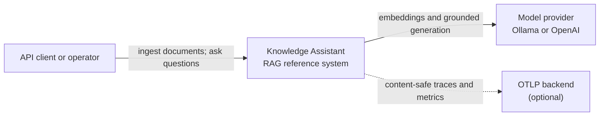
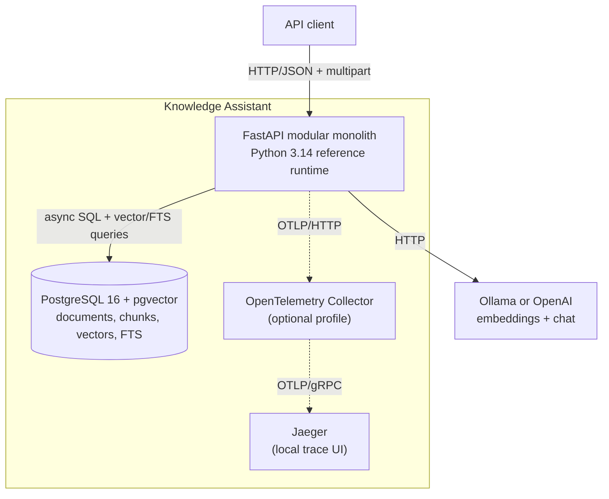
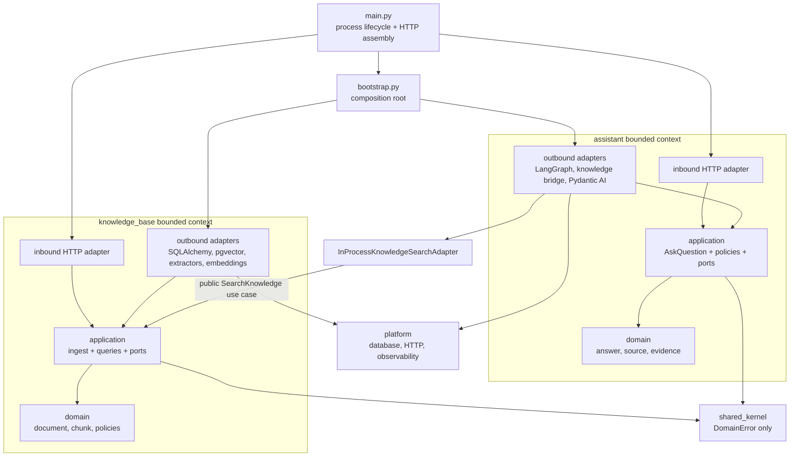

# Architecture overview

## Decision in one sentence

This system is a **modular monolith with two bounded contexts, pragmatic
ports and adapters, vertical use-case slices, and a functional core inside an
imperative shell**.

That is intentionally more formal than the default architecture for a small
Python API. The formality earns its keep here because document extraction,
embedding providers, retrieval, persistence, LLM generation, orchestration,
and HTTP are independently variable boundaries. It is not a recommendation
to wrap every Python project in hexagons.

## C4 level 1 — system context

PostgreSQL is inside the system boundary at this level: it is a deployment
component owned by the application, not another business system.

## C4 level 2 — containers

There is one deployable application, one database, and optional provider and
telemetry services. No broker, worker, command bus, service mesh, or
distributed transaction is hidden in the design.

## Internal architecture

Arrows express compile-time dependency. Within each context they point
inward: adapters → application → domain. Domain and application cannot import
FastAPI, SQLAlchemy, LangGraph, Pydantic AI, HTTPX, or OpenTelemetry.
Import-linter turns those statements into CI failures.

## Why a modular monolith

The two contexts have different ownership and language, but they share one
operational boundary today:

- deployment and schema changes are simpler;
- ingestion and search do not need distributed consistency;
- an in-process call is faster and easier to debug than a network hop;
- the explicit cross-context adapter preserves the option to split later.

A microservice split is justified only when a measured pressure appears:
independent scaling, security isolation, separate ownership, or asynchronous
ingestion that cannot be satisfied by an in-process deployment. The seam is
prepared; the distributed system is not prepaid.

## Quality attributes and the mechanism that protects them

| Attribute | Architectural mechanism |
| --- | --- |
| Grounding | non-refusal domain invariant, structured citation validation, deterministic refusal |
| Replaceability | consumer-owned Protocols only at volatile boundaries |
| Testability | pure policies, manual fakes, dependency overrides, real adapter integration tests |
| Consistency | PostgreSQL + pgvector in one transaction and schema |
| Availability | short transactions, bounded retries/timeouts, typed 502/503 failures |
| Evolvability | context-owned public application APIs and one explicit bridge |
| Privacy | content-free telemetry and no prompt/document logging by default |
| Supply chain | universal lockfile, immutable images/actions, audit, SBOM, CodeQL, Gitleaks, Trivy |

## Read next

1. [Bounded-context ownership](08-bounded-context-ownership.md)
2. [Pythonic ports and adapters](09-pythonic-ports-and-adapters.md)
3. [RAG pipeline](02-rag-explained.md)
4. [LangGraph as an adapter](03-langgraph-orchestration.md)
5. [Testing and evaluation](04-testing-strategy.md)

The key architecture decisions and their consequences are recorded in
[`docs/adr/`](adr/).
