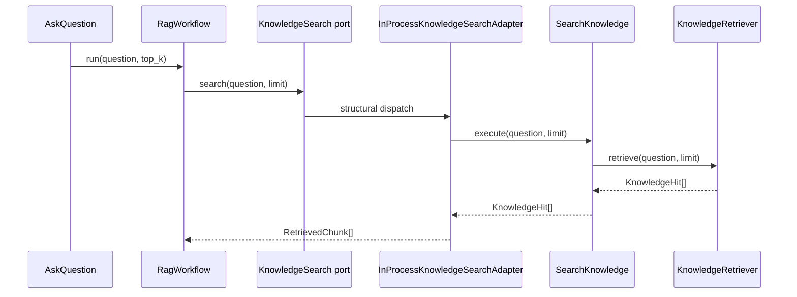

# Bounded-context ownership

The boundary between `knowledge_base` and `assistant` is semantic, not a
folder-only convention. Each context owns its language, invariants, use cases,
ports, and adapters.

## Ownership map

| Concept | Owner | Reason |
| --- | --- | --- |
| document, chunk, content hash | `knowledge_base` | lifecycle and persistence concepts |
| extraction and chunking | `knowledge_base` | indexing policy |
| embedding vector and dimension | `knowledge_base` | representation required by its search store |
| hybrid retrieval and RRF | `knowledge_base` | implementation of ranked knowledge search |
| question and top-k limits | `assistant` | assistant request invariant |
| retrieved evidence | `assistant` | evidence as consumed by answering, not a DB row |
| grading and generate/refuse routing | `assistant` | answer policy |
| answer, refusal, source | `assistant` | assistant output contract |
| HTTP, database lifecycle, telemetry | `platform` or inbound adapters | process concerns, never domain concepts |

The contexts deliberately use different representations at their boundary:
`knowledge_base.application.KnowledgeHit` becomes
`assistant.domain.RetrievedChunk`. That mapping prevents either side from
leaking its internal model into the other.

## Public application APIs

`knowledge_base` exposes use cases, not its tables:

- `IngestDocument`
- `GetDocument`
- `ListDocuments`
- `SearchKnowledge`

`assistant` exposes one primary use case:

- `AskQuestion`

Adapters may call these application APIs. Another context may not reach into
repositories, ORM models, domain aggregates, or SQL.

## The one cross-context bridge

`InProcessKnowledgeSearchAdapter` is the only sanctioned context-to-context
import. It performs two jobs:

1. translate knowledge-base read models into assistant evidence;
2. translate a knowledge-base outage into the assistant's retrieval failure.

If the contexts later deploy separately, an HTTP or gRPC adapter replaces
this class. `AskQuestion`, the workflow, policies, and assistant domain remain
unchanged.

## Shared kernel policy

`shared_kernel` contains only `DomainError`, the exception root used by both
contexts so the HTTP boundary has one stable mapping seam. It contains no
providers, repositories, services, IDs, vectors, configuration, or vendor
types.

The admission test for a shared-kernel type is strict:

- both domains use the same concept with the same meaning;
- neither context is the natural owner;
- duplicating and translating it would create semantic drift.

If any answer is “no”, the type stays in its context. This is why
`EmbeddingVector` belongs to `knowledge_base`, even though the RAG system as a
whole embeds both documents and questions: the assistant asks for knowledge
through a semantic search port and never manipulates vectors.

## What the architecture tests enforce

The import contracts prohibit:

- either context importing the other, except for the explicit bridge;
- adapter or platform imports from domain/application;
- framework imports from domain and application;
- LangGraph, Pydantic AI, SQLAlchemy, FastAPI, HTTPX, and OpenTelemetry inside
  the core.

Naming tests add a second defense: adapter classes expose their technology
coupling (`SqlAlchemy*`, `PgVector*`, `Ollama*`, `PydanticAi*`,
`LangGraph*`), while port modules contain only Protocols.

These rules make ownership reviewable in code and executable in CI rather
than dependent on a diagram staying current.
