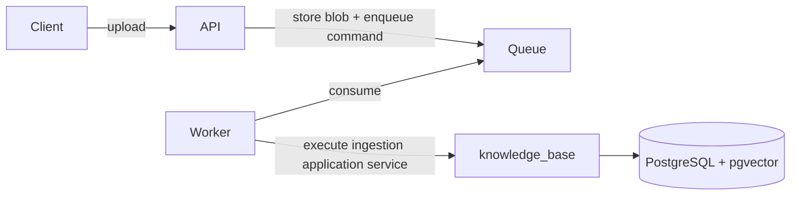

# Evolution without a rewrite

The current design is a synchronous-ingestion modular monolith. This document
shows how to evolve it when a measured requirement appears and which parts
must remain stable.

## 1. Move ingestion to a worker

Trigger: upload latency, CPU-heavy extraction, provider quotas, or the need to
retry independently of the HTTP request.



The HTTP adapter changes from “execute now” to “accept and report job status”.
A worker becomes another inbound adapter. Extraction, chunking, embedding
ports, persistence, and knowledge-base domain rules remain.

The current `IngestDocument` accepts bytes, so a production worker usually
adds a blob-storage port or a separate `IngestStoredDocument` use case rather
than sending large payloads through the broker. Idempotency must be based on a
stable command/document key and remain enforced by the database.

Do not start background tasks from FastAPI and call that a queue: process
restart would lose work and violate ownership of retries.

## 2. Replace the in-process context bridge

Trigger: independent scaling, different release cadence, security isolation,
or separate team ownership.

Replace `InProcessKnowledgeSearchAdapter` with an adapter implementing the
same assistant-owned `KnowledgeSearch` port over HTTP or gRPC:

```text
assistant application → KnowledgeSearch → HttpKnowledgeSearchAdapter
                                      → knowledge-base SearchKnowledge API
```

Define a versioned wire contract, deadlines, retry budget, authentication,
and observability before moving the network boundary. Preserve the translation
from remote failure to `RetrievalUnavailableError`.

Do not expose ORM or domain objects as the remote schema. The existing
`KnowledgeHit` → `RetrievedChunk` translation is the model to keep.

## 3. Add durable LangGraph execution

Trigger: multi-turn memory, human approval, workflows lasting beyond one
request, or recovery after process restart.

Add a checkpointer when compiling the graph and define:

- stable thread/run identifiers;
- retention and deletion policy;
- serialized-state compatibility;
- authorization for resuming a run;
- migration strategy for graph shape changes.

Checkpointing is not “free memory”. It creates persisted user data and a new
operational schema. The current stateless request/response flow should remain
the default until those requirements exist.

Streaming and replay belong to the same category: add them when they solve a
visible problem. Streaming is useful for long answers or a product experience
that must show progress. Replay is useful when operators need to debug or
audit intermediate state. Both require API contract, telemetry, privacy, and
test changes; neither is required for the current single-turn RAG workflow.

## 4. Introduce tenant isolation

Trigger: any private multi-customer deployment.

Tenant identity must enter at authentication and flow into every operation:

- document command and query ports;
- content hash uniqueness rules;
- retrieval filters in both dense and lexical legs;
- database keys/indexes or database/schema isolation;
- evaluation datasets and telemetry dimensions;
- deletion, export, and retention workflows.

Adding only a `tenant_id` column is insufficient if one retrieval query can
omit its predicate. Prefer a defense-in-depth design: application scoping,
database row-level security where appropriate, scoped object storage, and
adversarial cross-tenant tests.

## 5. Change the vector store or retrieval stack

Trigger: measured recall/latency limits, scale beyond PostgreSQL operational
targets, or features such as advanced metadata filtering and quantization.

Implement `KnowledgeRetriever` against the new store and update composition.
Keep `SearchKnowledge` and `KnowledgeHit` stable. Plan explicitly for:

- backfill and dual-read validation;
- embedding-model/dimension migration;
- delete/update consistency;
- lexical+dense fusion equivalence;
- evaluation baseline comparison before cutover.

Dual-write without reconciliation is not a migration strategy.

## 6. Stream answers

Trigger: measured user-perceived latency.

Streaming changes the HTTP and `AnswerGenerator` contracts and complicates
the core grounding invariant: a source cannot be validated after unsupported
text has already reached the client. Choose one:

- validate a structured answer first, then stream presentation;
- stream provisional output with a protocol that can retract/fail;
- use sentence-level generation with evidence validation.

Do not weaken “no affirmative answer without valid sources” merely to emit
the first token sooner.

## Decision rule for every evolution

1. Name the measured pressure.
2. Identify the current port or public application API at the seam.
3. Add the smallest adapter or use case that satisfies it.
4. Define failure, cancellation, idempotency, and migration behavior.
5. compare RAG evaluation and operational baselines.
6. Record an ADR if the decision changes a boundary or deployment topology.

Architecture is successful when change is local and explicit, not when every
future component already exists.
